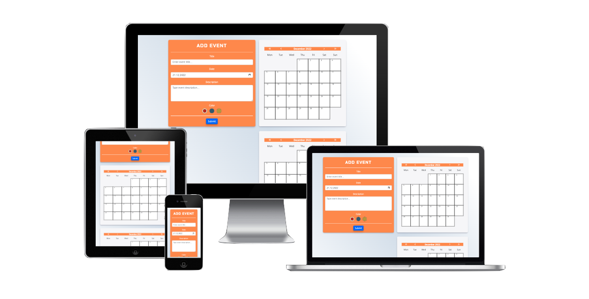
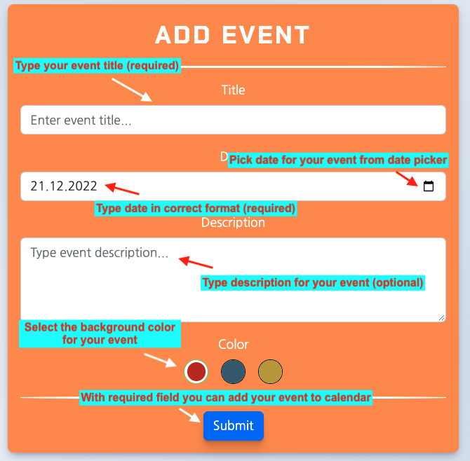
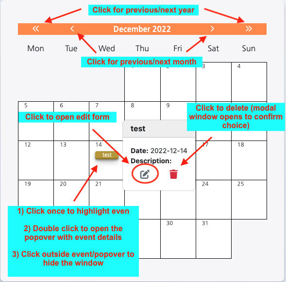
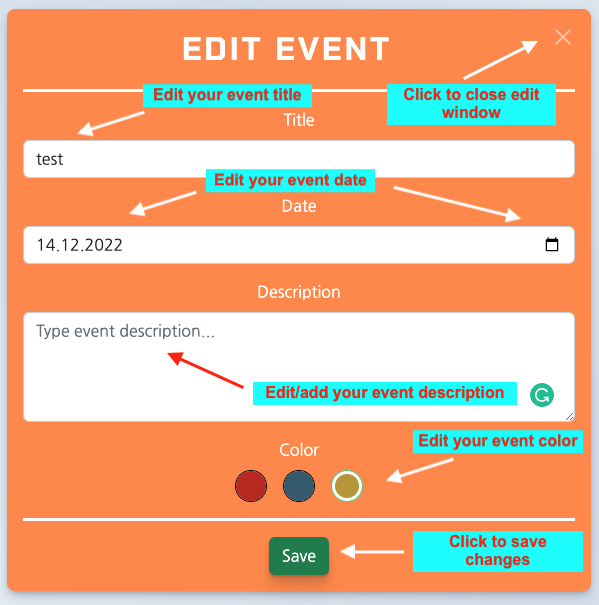

# 
 Byss Calendar App :calendar:
<!-- omit in toc -->

##  <!-- omit in toc -->

## **Table of Contents**

- [**Table of Contents**](#table-of-contents)
- [**Overview**](#overview)
  - [Production](#production)
- [**Technologies Used**](#technologies-used)
- [**How to use?**](#how-to-use)
  - [Add Event](#add-event)
  - [Calendar Actions](#calendar-actions)
  - [Edit Event](#edit-event)
  - [Drag and drop functionality (desktop only)](#drag-and-drop-functionality-desktop-only)
- [**Credits**](#credits)
- [**Acknowledgments**](#acknowledgments)

## **Overview**

This project serves as a **Junior Frontend Developer** recruitment task for [byss](https://byss.pl/). It is a simple web application for managing events with two calendars. Events can be moved between calendars with drag-and-drop motion. The app allows for multiple events handling. Full CRUD functionality is implemented with client-side-only mockup data.

The app is fully responsive and was tested on different screen sizes.

Drag and drop functionality is only available for mouse movement. To move events on touch screens users must edit the date in the edit form.

### Production

The production version can be found [here](https://deluxe-trifle-050594.netlify.app/).

[Back to contents](#table-of-contents)

## **Technologies Used**

- ### Languages

  - [JS](https://www.javascript.com/): the primary language used to develop interactive components of the website.
  - [HTML](https://developer.mozilla.org/en-US/docs/Web/HTML): the markup language used to create the website.
  - [CSS](https://developer.mozilla.org/en-US/docs/Web/css): the styling language used to style the website.

- ### Front-End Frameworks and Libraries

  - [ReactJS](https://reactjs.org/): version 18.2.0, was used for building a user interface
  - [React Bootstrap](https://react-bootstrap-v4.netlify.app/): version 2.7.0, was used to style the app with built-in tools.
  - [styled-components](https://styled-components.com/): version 5.3.6, was used to inject CSS styling directly to component.
  
- ### Other tools

  - [Netlify](https://www.netlify.com/): was used to build and host the front-end.
  - [Git](https://git-scm.com/): the version control system used to manage the code.
  - [Vite](https://vitejs.dev/): was used as a frontend development building tool.
  - [GitHub](https://github.com/): used to host the website's source code.
  - [VSCode](https://code.visualstudio.com/): the IDE used to develop the website.
  - [Fontawesome](https://fontawesome.com/): was used to implement icons with animation.
  - [Grammarly](https://www.grammarly.com/): was used to check grammar and typo errors.
  - [eslint](https://eslint.org/): ESLint statically analyzes code to quickly find problems. Was used to check any linting errors and warning in the code.

[Back to contents](#table-of-contents)

## **How to use?**

Open the app by navigating to **[this](https://deluxe-trifle-050594.netlify.app/)** page.

### Add Event

### Calendar Actions

### Edit Event

### Drag and drop functionality (desktop only)

1. To change event date **press** and **hold** **left mouse key** and move the event to respective date.
2. To select multiple events press **cmd/ctrl + left mouse keys**. The animation will indicate selected events.

   - to relocate events **press and hold** any from selected events and drop them in the respective date square.
3. The drag and drop is available inside each calendar and in between calendars.

## **Credits**

1. All fonts come from [Google Fonts](https://fonts.google.com/).
2. The calendar favicon comes from [pngfind.com](https://www.pngfind.com/)

[Back to contents](#table-of-contents)

## **Acknowledgments**

1. **[byss](https://byss.pl/) Recruitment Team** - for giving me a chance to improve my skills by doing this task - regardless of the outcome it was a great experience for self-development. Thank you!
2. As always big thanks to [Stack Overflow](https://stackoverflow.com/) community for the best bug-solving space ever created!

[Back to contents](#table-of-contents)

---
**
Created by Milosz Misiek
**

    

